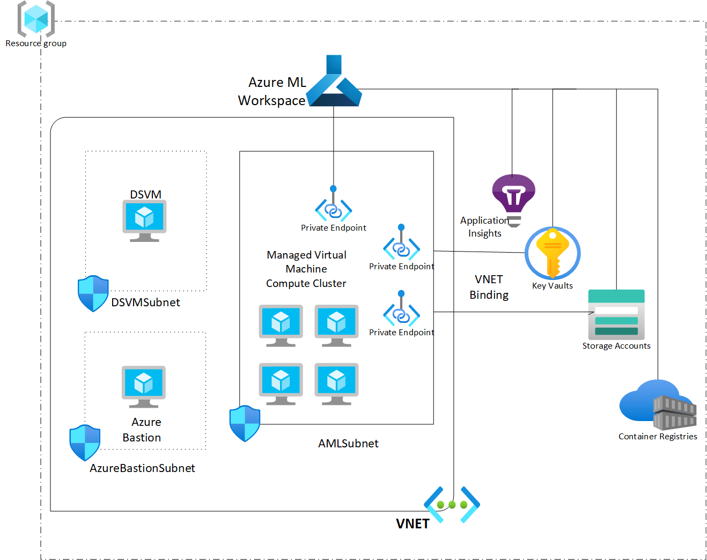
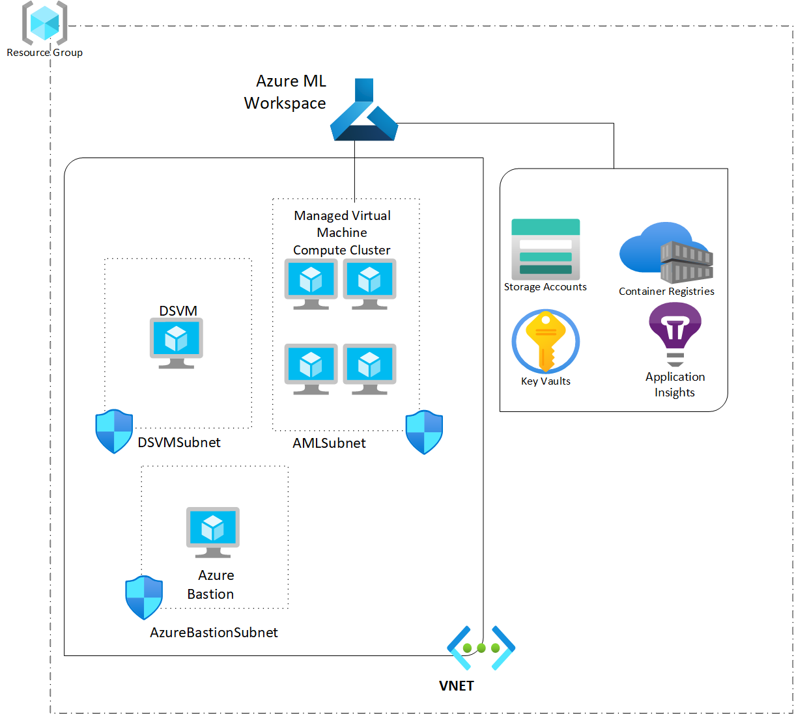

# Azure Machine Learning Deployment

This template deploys complete Azure Machine Learning enviornment via Terraform with very minimal inputs. It supports two kinds of following Azure Machine Learning deployments.

- Azure ML with private endpoints and VNet binding (fully secured)
- Azure ML without private endpoints and VNet binding.

With a single switch of terraform parameter you can choose which kind of AML architecture you want to deploy. The details of these deployments are discussed in the next sections.

## Architecture for Azure ML Resources With Private Endpoints and VNet Binding

This includes deployment of the following resources:

- Azure Machine Learning Workspace with Private Link.
- Azure Storage Account with Private Link for Blob and File and VNET binding with Service Endpoints.
- Azure Key Vault with Private Link for Vault and VNET binding with Service Endpoints.
- Azure Container Registry (Private endpoints and VNET binding is not enabled as this feature needs to be requested from MSFT).
- Azure Application Insights.
- DSVM (Windows) for development and testing (in VNET and DSVMSubnet).
- DSVM is setup to auto shutdown at 18:00 PST to save on costs.
- Azure Bastion Host as an entry point to access the locked down enviornment via DSVM.
- One Virtual Network.
- AMLSubnet for AML Compute and AML resources such as Storage and KeyVault.
- DSVMSubnet for DSVM.
- AzureBastionSubnet for Bastion Host.
- Network Security group for DSVMSubnet which accepts incoming traffic from Bastion Host only.
- Network Security group for AzureVMSubnet which accepts incoming traffic from AzureCloud, GatewayManager and HTTPs.
- Managed AML Compute Cluster with scale up to 4 VMs (in VNET and AMLSubnet).
- Creates timestamp, create-by and environment Tags to all resources.

## Architecture for Azure ML Resources Without Private Endpoints and VNet Binding

This includes deployment of the following resources:

- Azure Machine Learning Workspace.
- Azure Storage Account.
- Azure Key Vault.
- Azure Container Registry.
- Azure Application Insights.
- DSVM (Windows) for development and testing (in VNET and DSVMSubnet).
- DSVM is setup to auto shutdown at 18:00 PST to save on costs.
- Azure Bastion Host as an entry point to access the locked down enviornment via DSVM.
- One Virtual Network.
- AMLSubnet for AML Compute Cluster.
- DSVMSubnet for DSVM.
- AzureBastionSubnet for Bastion Host.
- Network Security group for DSVMSubnet which accepts incoming traffic from Bastion Host only.
- Network Security group for AzureVMSubnet which accepts incoming traffic from AzureCloud, GatewayManager and HTTPs.
- Managed AML Compute Cluster with scale up to 4 VMs (in VNET and AMLSubnet).
- Creates timestamp, create-by and environment Tags to all resources.

## Prerequisites

Make sure you have the [Azure CLI](https://docs.microsoft.com/en-us/cli/azure/install-azure-cli) and the Azure Machine Learning CLI extension installed (`az extension add -n azure-cli-ml`).

[Install Terraform](https://learn.hashicorp.com/tutorials/terraform/install-cli#install-terraform)

## Run Deployment

Navigate to `deployment\terraform\aml`

- Run terraform init
- Run terraform plan
- Run terraform apply

> You will need to provide values for `project_code` and `env_code`. Value for `location` is set to `West US 2` and `enable_private_link` is set to `true`.
